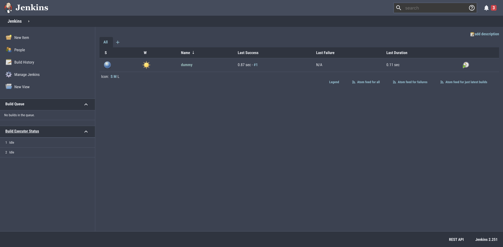
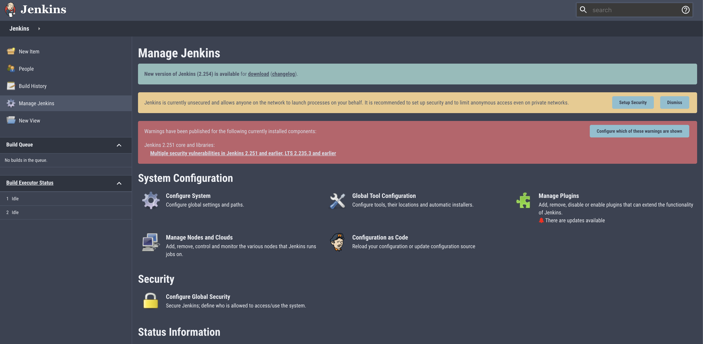
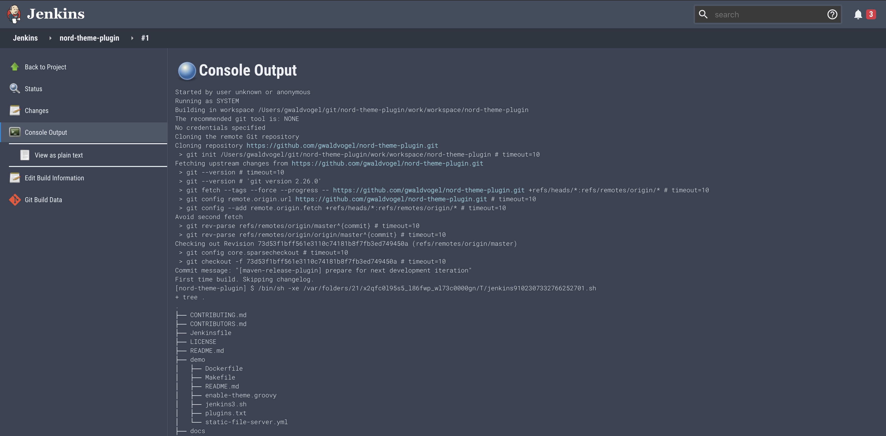

# Nord Theme for Jenkins

This repository contains a theme based on the [Nord color palette dark](https://www.nordtheme.com/).

This theme is based on the dark theme for Jenkins which can be found [here](https://github.com/jenkinsci/dark-theme-plugin).
Creating this theme so easily wouldn't have been possible without the original work.

I have no plans to publish this right now, if you want me to, leave a message [here](https://github.com/gwaldvogel/nord-theme-plugin/issues/1).

## Screenshots

Main screen:

Admin screen:

Build console:

## Browser compatibility

The theme should be compatible with all modern browsers.

No version of IE will be supported.

## References

* Nord repository: https://github.com/arcticicestudio/nord
